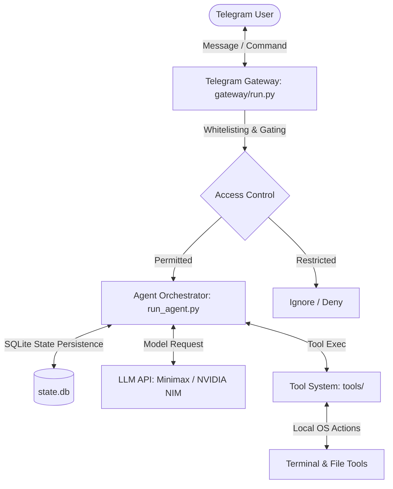

# MiniHermes Telegram Bot ☤

MiniHermes is a simplified, secure, and lightweight AI Agent designed specifically to run as a Telegram Bot. It is built upon the robust tool-calling core of the Hermes Agent, pruned and optimized to run efficiently with minimal dependencies on standard environments (such as a $5 VPS or cloud instances).

This project focuses on running a single Telegram Gateway interface using local terminal and file operations, leveraging the **MiniMax (M2.7)** model via NVIDIA NIM or other LLMs.

---

## 🏗️ Software Architecture

MiniHermes operates on a clean, decoupled architecture consisting of three primary layers: the **Gateway Interface**, the **Agent Orchestrator**, and the **Tool Execution System**.



### 1. Telegram Gateway (`gateway/`)
* **Entrypoint**: Started via `cli.py --gateway` or the helper script `start_telegram_bot.sh`.
* **Platform Gateway**: Utilizes the `python-telegram-bot` polling interface, handling connection recovery and keeping local session state alive.
* **Access Whitelisting**: Implements secure user-level access restriction. It reads `TELEGRAM_ALLOWED_USERS` from the environment configuration and ensures unauthorized users cannot interact with the agent or run commands on the server host.

### 2. Agent Orchestrator (`run_agent.py` & `agent/`)
* **Context Loop**: Manages system prompt construction, history summarization, and parsing model tool-call instructions.
* **State Persistence**: Uses SQLite (`state.db`) for tracking user sessions, memory nodes, task histories, and conversational context across restarts.
* **Auxiliary Services**: Houses local session search, prompt builders, and pricing calculators.

### 3. Tool Execution System (`tools/`)
For safety, speed, and simplicity, this codebase has been pruned to keep only essential system-management tools:
* **Terminal Tool (`tools/terminal_tool.py`)**: Runs shell commands and scripts in a local bash execution sandbox.
* **File Operations (`tools/file_tools.py`)**: Reads, writes, edits, and searches files in the workspace.
* **Pruned Integrations**: Heavy and unused features (browser automation, Feishu, Discord, Slack, Spotify, Meet, voice generation, etc.) have been completely removed to keep the deployment footprint small and memory usage low.

---

## ⚙️ Configuration & Environment (`.env`)

Configure the bot by creating a `.env` file in the root directory. Below is a template of the critical keys required for operation:

```ini
# --- Telegram Bot Settings ---
TELEGRAM_BOT_TOKEN="your_telegram_bot_token"

# --- Security Access Control ---
TELEGRAM_ALLOW_ALL_USERS="0"
TELEGRAM_ALLOWED_USERS="550914711"  # Whitelisted user IDs (comma-separated)

# --- Model & API Keys ---
NVIDIA_API_KEY="your_nvidia_nim_api_key"
OPENAI_API_KEY=""

# --- Agent Parameters ---
HERMES_MAX_ITERATIONS=90
```

> [!IMPORTANT]
> To prevent public access risks, ensure `TELEGRAM_ALLOW_ALL_USERS` is set to `"0"` and define your Telegram User ID in `TELEGRAM_ALLOWED_USERS`.

---

## 🚀 Getting Started

### Prerequisites
* Python 3.10+
* A Python virtual environment with dependencies installed:
  ```bash
  python3 -m venv .venv
  source .venv/bin/activate
  pip install -r requirements.txt
  ```

### Running the Bot
Launch the Telegram gateway bot directly using the provided startup script:
```bash
./start_telegram_bot.sh
```

The script will:
1. Activate the python virtual environment (`.venv`).
2. Load configurations and API keys from `.env`.
3. Check and assert environment whitelisting rules.
4. Launch the gateway daemon in the foreground (Press `Ctrl+C` to terminate).

---

## 🛠️ Development & GitHub Upload

As you prepare to upload this codebase to a new GitHub repository, follow these clean-up guidelines:

### 1. Version Control Exclusions (`.gitignore`)
The `.gitignore` has been updated to exclude all runtime databases, logs, virtual environments, and downloaded compiled binaries:
* `*.db*` (SQLite session state & kanban databases)
* `logs/` (Gateway and agent run logs)
* `/bin/` (Downloads of security scanners like `tirith`)
* `.venv/` (Python virtual environment)
* `.env` (Secret keys - never commit this!)

### 2. Uploading to a New Repository
Run the following commands in the project root to initialize a new git history and upload it to GitHub:
```bash
git init
git add .
git commit -m "Initial commit: Simplified MiniHermes Telegram Bot"
git branch -M main
git remote add origin git@github.com:yourusername/minihermes-bot.git
git push -u origin main
```
